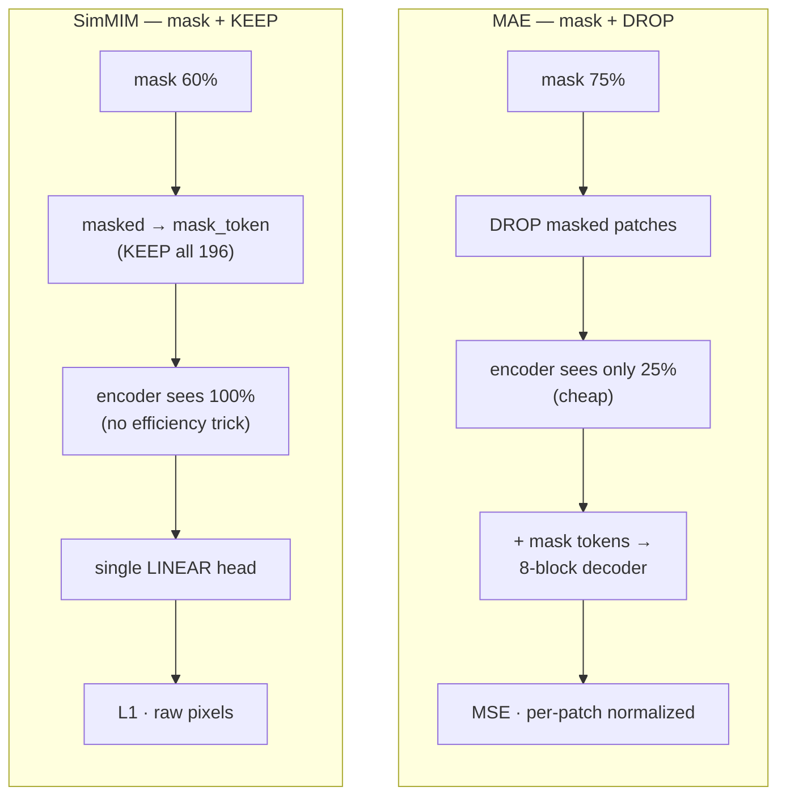
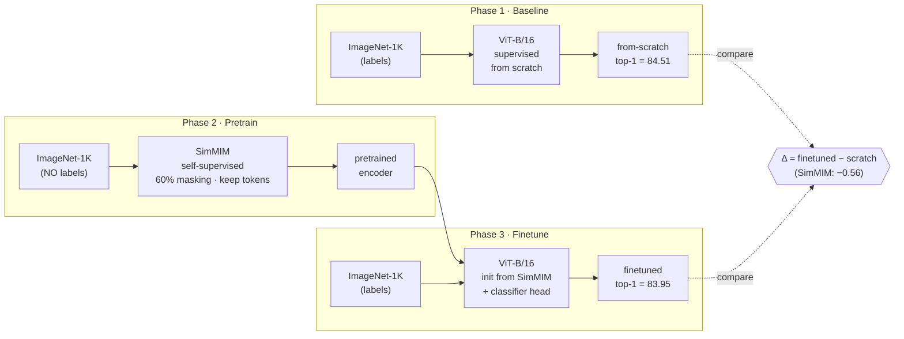
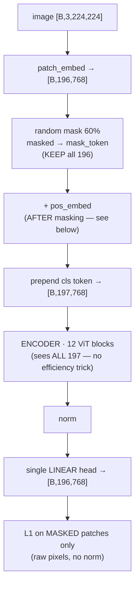
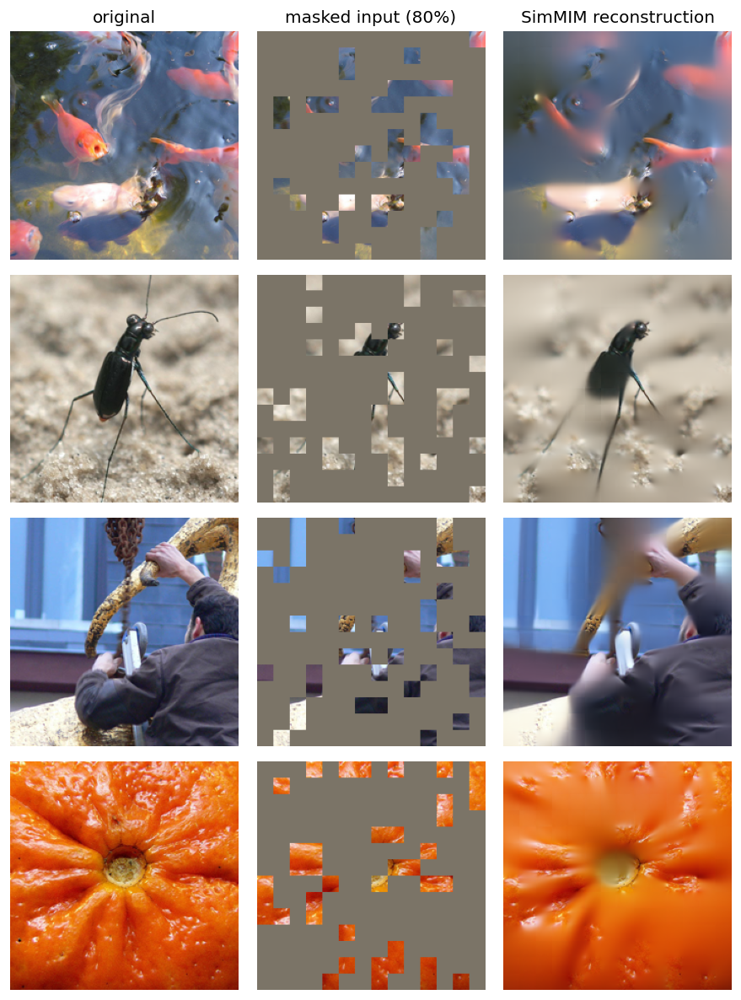
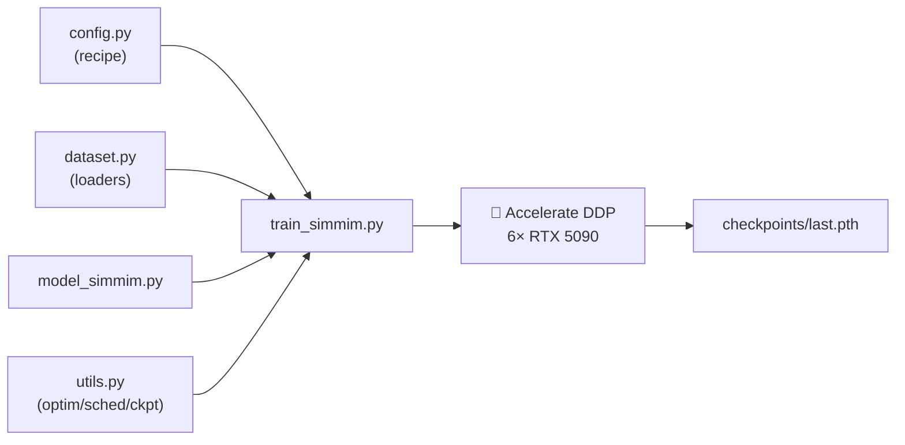

# SimMIM from Scratch on ImageNet-1K

Reproducing **SimMIM: A Simple Framework for Masked Image Modeling** (Xie et al., CVPR 2022) end-to-end as a learning project — a supervised baseline, self-supervised SimMIM pretraining, and finetuning, all built from scratch with PyTorch + 🤗 Accelerate on a 6× RTX 5090 box.

This is the **SimMIM** arm of a two-model **masked-image-modeling (MIM)** study on the same box and recipe; the **MAE** arm lives on the `main` branch. Together they answer: *how do the two dominant MIM recipes — **MAE (mask-and-drop)** and **SimMIM (mask-and-keep)** — compare with each other and with a strong ViT-B/16 trained from scratch?*

**The answer:** both MIM recipes finetune to **~parity** with a strong supervised baseline, and **SimMIM ≈ MAE** on ViT-B/16 — the peers-on-ViT-B result the papers report. SimMIM's advantage over MAE isn't ViT-B accuracy; it's that *keeping* the masked tokens lets it work with hierarchical backbones (Swin/SwinV2) that MAE's token-dropping can't.

| Model | Init | Top-1 (`/val`) | Δ vs scratch |
|---|---|---|---|
| ViT-B/16 from scratch | random | **84.51%** | — |
| ViT-B/16 finetuned — MAE | MAE 400-ep | **84.27%** | −0.24 |
| ViT-B/16 finetuned — **SimMIM** | **SimMIM 400-ep** | **83.95%** | **−0.56** |

---

## MIM: drop (MAE) vs keep (SimMIM)

Both mask patches and reconstruct pixels. The difference is what the **encoder** sees:



| | MAE | **SimMIM (this branch)** |
|---|---|---|
| masked patches | **dropped** (encoder sees 25%) | **kept** as `mask_token` (sees 100%) |
| head | 8-block / 512-d decoder | **single `nn.Linear`** |
| target / loss | per-patch-norm pixel **MSE** | raw pixel **L1** |
| mask ratio | 75% | 60% |
| backbones | ViT only | ViT **+ Swin / hierarchical** |
| params (pretrain) | 111.9 M *(+26 M decoder)* | **86.4 M** *(+0.6 M head)* |
| 1-GPU cost @ B=128 *(measured)* | **1778 img/s · 8.2 GB** | 1164 img/s · 10.2 GB |

---

## The 3-phase design



Phase 1 gives the honest *from-scratch* number. Phase 2 learns representations with **no labels**. Phase 3 finetunes that encoder and measures the gap.

---

## How SimMIM works (Phase 2)

Mask **60%** of the patches, replace them with a learnable `mask_token` (**keep all 196**), and let the full ViT encoder predict the missing raw pixels through a **single linear layer**. No decoder, no tokenizer, no per-patch normalization — the "simple" in SimMIM.



The one subtlety that cost a debugging session: **`pos_embed` must be added *after* masking**. The mask tokens are identical to each other, so without position encodings inside the encoder the model can't tell *where* it's predicting — it collapses to the per-channel mean and the loss flatlines (~0.78). Adding `pos_embed` after the mask-token swap fixed it (loss → ~0.2). Written up in [Issues](../../issues?q=is%3Aissue).

---

## Reconstructions

MIM made visual — **drop (MAE) vs keep (SimMIM)**, same four images, same 80% mask.

**MAE** (mask-and-drop): the encoder sees only the 20% of patches in the middle column; the decoder fills the rest.


**SimMIM** (mask-and-keep): the encoder sees all patches (masked ones as `mask_token`); the single linear head predicts the masked pixels.



*Both: left → original · middle → 80%-masked input · right → the model's reconstruction. MAE was pretrained at 75% masking, SimMIM at 60% — both shown here at a harder **80%** to stress-test. Blurry because it's pixel MSE/L1, not a GAN, but *semantically right*: goldfish, beetle legs, the arm, the orange's radial texture all inferred from a fifth of the image. (SimMIM per-image L1 = 0.31–0.37 @80% and 0.21–0.25 @60% — vs ~0.80 for a random init — confirming these are the trained model's outputs, not noise.)*

---

## Repo structure

```
phase1/   supervised ViT-B/16 from scratch     → the baseline
phase2/   SimMIM self-supervised pretraining    (model_simmim.py, train_simmim.py)
phase3/   finetune the pretrained encoder
run_simmim.sh · run_phase{1,3}.sh   Accelerate launch scripts (6-GPU DDP)
```

Each phase is self-contained: `config.py` (recipe as a class), `dataset.py` (timm transforms + loaders), `model*.py`, `train*.py`, `utils.py`.



---

## Training recipe (SimMIM pretrain)

| | |
|---|---|
| Backbone | ViT-B/16 encoder (no decoder) |
| Masking | 60% random, masked → `mask_token` (kept) |
| Head | single `nn.Linear(768 → 16·16·3)` |
| Loss | raw-pixel **L1**, masked patches only |
| Optimizer | AdamW (β = 0.9, 0.95), weight decay 0.05 |
| LR | 1.5e-4 base, linear-scaled by batch, 40-epoch warmup + cosine |
| Batch | 128/GPU × 6 GPUs × 6 accum = **4608 effective** |
| Epochs | **400** |
| Precision | bf16 |
| Final recon | L1 ≈ 0.2 |

---

## Results

All numbers on the **held-out 50k `/val`** — same set, same eval protocol + EMA, same matched recipe (train 1.23M, timm RandAugment + Random Erasing) for **all three** models. The *only* difference is the encoder's initialization, so the delta is clean.

| Model | Init | Top-1 (`/val`) |
|---|---|---|
| ViT-B/16 from scratch (Phase 1) | random | **84.51%** |
| ViT-B/16 finetuned — MAE | MAE 400-ep pretrain | **84.27%** |
| **ViT-B/16 finetuned — SimMIM** | **SimMIM 400-ep pretrain** | **83.95%** |
| **Δ (SimMIM − scratch)** | | **−0.56%** |
| **Δ (SimMIM − MAE)** | | **−0.32%** |

SimMIM finetunes to **near-parity** with the strong from-scratch baseline and lands **~0.3 below MAE** — right at the edge of run-to-run seed noise (±0.1–0.3%). On ViT-B/16 the two MIM recipes are **peers**, matching their papers (MAE 83.6 / SimMIM 83.8 official top-1).

---

## Findings

**Both MIM recipes reach ~parity with a strong baseline; SimMIM ≈ MAE.**

- **SimMIM ≈ MAE (−0.32).** At the edge of seed noise — the two masked-image-modeling recipes are peers on ViT-B/16, as the papers report (SimMIM 83.8 vs MAE 83.6 official). The small gap here is consistent with MAE being marginally stronger on ViT-B *and* with this SimMIM running the MAE-style optimization recipe (mask 60% at **16×16 token granularity** vs the paper's 32×32 masked blocks, AdamW, 400 ep) rather than SimMIM's paper-exact hyper-parameters. **But "equal on finetune" hides very different features:** SimMIM's frozen encoder linear-probes to just **31%** vs MAE's **59%** (see [What MIM buys you](#what-mim-buys-you-and-mae-vs-simmim)) — same accuracy after finetuning, very different feature geometry.
- **Both near-parity with scratch.** The supervised baseline (84.51) is *strong* — right at the number the MAE paper reports for its own from-scratch ViT-B. Against it, MAE lands −0.24 and SimMIM −0.56: **neither MIM recipe *beats* a well-tuned supervised ViT-B** on the same labeled ImageNet-1k.
- **The finetune trajectory.** SimMIM warmed up **slower** than MAE (at ep30 it trailed by ~4 points) but the gap closed monotonically to land at 83.95 — a slower-to-align but healthy encoder. The slow start is mechanistic: SimMIM's encoder was tuned to regress raw pixels over the *full* grid, so the GAP + LLRD classification head takes more epochs to reorganize those features than it does for MAE's.

**Why parity, not a win:** MIM's edge over supervised training is **conditional on baseline strength** and shows up with **extra unlabeled data / model scale / few labels** — none of which this matched, single-dataset ViT-B comparison exercises. Reproducing a MIM "win" needs a weaker baseline or a downstream regime, not this elite one.

---

## What MIM buys you (and MAE vs SimMIM)

- **The MIM signature (linear probe) — and SimMIM shows it *harder* than MAE.** Freeze the encoder, train *only* a linear head (identical probe protocol for both): **SimMIM = 31.2%** vs **MAE = 59%** — yet both **finetune to ~84%**. So SimMIM's probe→finetune gap is a staggering **~53 points** (MAE's is ~25). MIM features are **rich but not linearly separable** — the mirror image of contrastive/DINO — and SimMIM's are *even less* so. One plausible reading: when the encoder sees the whole image and only has to feed a trivial linear pixel head, it does less "understanding" work than MAE's encoder (which infers global structure from just 25% of patches), so SimMIM's features sit lower-level — superb finetuning inits, poor linear readouts. **This gap is documented, not a protocol fluke:** the papers report **SimMIM 56.7% vs MAE 68.0%** linear probe under their tuned 800-ep LARS protocol (~11 pts) — and SimMIM's paper explicitly de-emphasizes the metric (*"our main goal is to learn representations which can well complement the following down-stream tasks"*). Our simpler 400-ep cached probe suppresses *both* absolutes (→ 31 and 59) and widens the gap — exactly what independent simple-protocol evals show (SimMIM collapses toward the teens–20s, MAE stays robust). The direction is the point: same finetune accuracy, very different linear separability.
- **MAE's edge = compute.** MAE drops 75% of patches, so its encoder attends over 49 tokens vs SimMIM's 197 → at a matched batch it runs **~1.5× faster in ~20% less memory** (measured, 1-GPU) *despite carrying 30% more params* (the 26 M decoder). SimMIM keeps all patches → the full-grid encoder is the cost. *(The paper's 3.3× FLOPs / 2.8–4.1× wall-clock is a different comparison — MAE vs a full-token MAE that keeps the decoder; here SimMIM drops the decoder, so MAE's edge over it is smaller. See [Cost & footprint](#cost--footprint-measured).)*
- **SimMIM's edge = architecture.** Keeping the masked tokens preserves the full spatial grid, so SimMIM works natively with **hierarchical / windowed backbones (Swin, SwinV2)** — which is how SimMIM scales to SwinV2-Huge (87%). MAE structurally can't drop tokens in a windowed backbone.

**One-line takeaway:** *on ImageNet-1k ViT-B, MAE and SimMIM are accuracy-equal and both ≈ a strong supervised baseline — you pick MAE for cheap ViT pretraining and SimMIM for hierarchical backbones.*

---

## Cost & footprint (measured)

Parameter counts and per-GPU cost, **measured** on one RTX 5090 (bf16, forward + backward + AdamW step):

| | MAE | SimMIM |
|---|---|---|
| **total params** (pretrain model) | **111.9 M** | **86.4 M** |
| — ViT-B/16 encoder *(transfers to finetune)* | 85.8 M | 85.8 M |
| — extra head | 26.1 M *(8-block decoder)* | 0.6 M *(single linear)* |
| peak GPU mem @ training batch | 11.5 GB (B=192) | 10.2 GB (B=128) |
| **peak GPU mem @ matched B=128** | **8.2 GB** | **10.2 GB** |
| **1-GPU throughput @ B=128** | **1778 img/s** | **1164 img/s** |
| finetune classifier *(shared)* | 86.6 M ViT-B/16 | 86.6 M ViT-B/16 |

**The drop-75% payoff (the counter-intuitive bit):** at a matched batch MAE runs **~1.5× faster** in **~20% less memory** — *even though MAE has 30% more parameters* than SimMIM (the 26 M decoder). MAE's encoder attends over 49 tokens vs SimMIM's 197, and attention is quadratic, so the encoder saving outweighs the decoder's cost. *(Careful with the headline: MAE's paper reports **3.3× fewer FLOPs / 2.8–4.1× wall-clock**, but that's MAE vs a **full-token MAE that still keeps the 8-block decoder** — a different comparison. Here SimMIM has **no decoder** (just a linear head), so it's already a leaner baseline and MAE's edge over it is smaller; add ViT-B + small consumer-GPU batches that under-expose the quadratic-attention saving, and the measured MAE-vs-SimMIM gap is ~1.5×. Worth checking what a headline number is measured against.)*

**Real training cost (6× RTX 5090, comm-bound):** both pretrained at ~7000–7500 img/s *aggregate* — the per-GPU compute gap is mostly absorbed by the PCIe all-reduce wall (below), so wall-clock is similar: **~19–20 h / 400 epochs ≈ ~115 GPU-hours** each pretrain. Finetune: ~10 h / 100 epochs ≈ **~60 GPU-hours**. Both paths hand the identical **85.8 M** ViT-B encoder to Phase 3.

---

## Hardware & the performance story

Trained on **6× RTX 5090** (a 7th GPU, an RTX 3090, is deliberately excluded). Consumer 5090s have **no GPU-to-GPU P2P**, so every gradient all-reduce is *host-staged over PCIe at ~2.2 GB/s* across two NUMA sockets — a hard comm wall that caps multi-GPU scaling.

- **`pin_memory=True` + `prefetch_factor=4`** — the loader fix that overlaps the CPU→GPU batch copy with compute, taking pretrain from ~3000 to **~7500 img/s**.
- **A note on MIM compute:** SimMIM's encoder sees **100%** of patches vs MAE's 25%, so it is inherently more expensive per step. On this **comm-/IO-bound** box that difference is largely hidden behind the data-pipeline ceiling (SimMIM pretrained at a similar ~7k img/s) — but on a *compute-bound* cluster, MAE's **~1.5× per-image compute edge** (measured, see [Cost & footprint](#cost--footprint-measured)) would be very visible.
- What **didn't** help, despite testing: bigger batch (0%), `torch.compile` (+1.6% — the run is comm-bound).

Every non-trivial problem — the 6-GPU crash, the comm wall, the `pin_memory` hunt, and the SimMIM **`pos_embed`-after-masking** bug — is written up in **[Issues](../../issues?q=is%3Aissue)**.

---

## Running it

```bash
# Phase 2 — SimMIM pretraining (6-GPU DDP)
bash run_simmim.sh

# Phase 3 — finetune from the SimMIM checkpoint
#   set phase3/config.py:  mae_ckpt = ".../phase2/try1/simmim_V1/last.pth"
bash run_phase3.sh 5
```

Requirements: `torch`, `timm`, `accelerate`, `transformers`, and **`nvidia-nccl-cu12==2.26.5`** (the bundled NCCL 2.26.2 crashes on the 5090). Always launch via the `run_*.sh` scripts — they pass `--gpu_ids 0,1,2,3,5,6` (excluding the 3090, which otherwise triggers an illegal-memory crash) and set up the NCCL/comm environment.

---

## References

Xie, Zhang, Cao, Lin, Bao, Yao, Dai, Hu. *SimMIM: A Simple Framework for Masked Image Modeling.* CVPR 2022. [arXiv:2111.09886](https://arxiv.org/abs/2111.09886)

He, Chen, Xie, Li, Dollár, Girshick. *Masked Autoencoders Are Scalable Vision Learners.* CVPR 2022. [arXiv:2111.06377](https://arxiv.org/abs/2111.06377)
