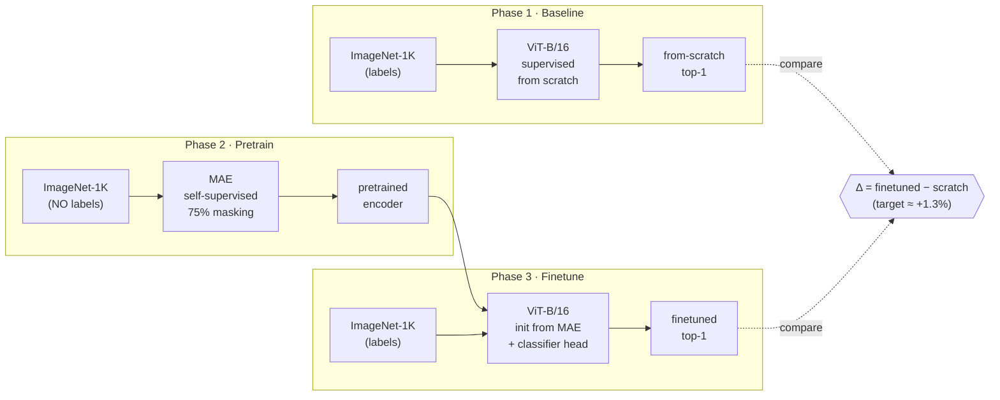
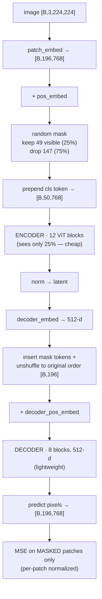
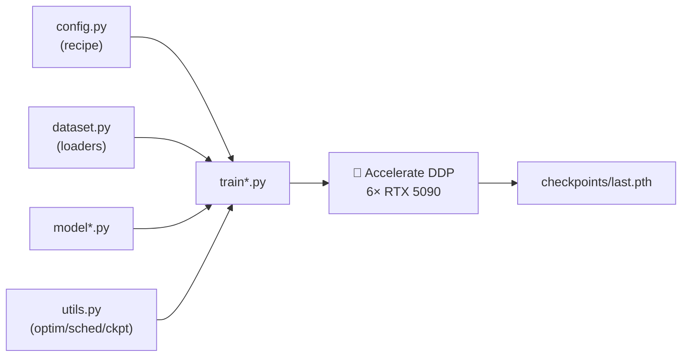
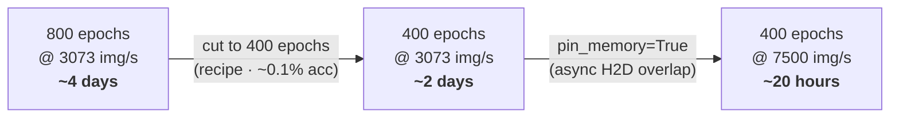

# MAE from Scratch on ImageNet-1K

Reproducing **Masked Autoencoders Are Scalable Vision Learners** (He et al., CVPR 2022) end-to-end as a learning project — a supervised baseline, self-supervised MAE pretraining, and finetuning, all built from scratch with PyTorch + 🤗 Accelerate on a 6× RTX 5090 box.

**The question this repo answers:** *how much does MAE self-supervised pretraining actually buy you over training the same ViT-B/16 from scratch?* The paper reports ≈ **+1.3%** top-1. This reproduces that delta — and documents the multi-GPU engineering needed to make it train fast on consumer GPUs with no P2P.

---

## The 3-phase design



Phase 1 gives the honest *from-scratch* number. Phase 2 learns representations with **no labels**. Phase 3 finetunes that encoder and measures the gap — the whole point of the project.

---

## How MAE works (Phase 2)

Mask **75%** of the patches and reconstruct the missing pixels. The design is **asymmetric**: the heavy encoder only ever sees the visible 25%, so pretraining is cheap.



The masking trick: draw random noise per patch, `argsort` it to get a shuffle, keep the first 49, and remember the inverse permutation (`ids_restore`) so the decoder can un-shuffle the visible tokens + mask tokens back into image order.

---

## Repo structure

```
phase1/   supervised ViT-B/16 from scratch   → the baseline
phase2/   MAE self-supervised pretraining     (model_mae.py, train_mae.py)
phase3/   finetune the pretrained encoder
run_phase{1,2,3}.sh   Accelerate launch scripts (6-GPU DDP)
```

Each phase is self-contained: `config.py` (recipe as a class), `dataset.py` (Albumentations + loaders), `model*.py`, `train*.py`, `utils.py`.



---

## Training recipe (MAE pretrain)

| | |
|---|---|
| Backbone | ViT-B/16 encoder + 8-block / 512-d decoder |
| Masking | 75% random |
| Loss | per-patch-normalized pixel MSE, masked patches only |
| Optimizer | AdamW (β = 0.9, 0.95), weight decay 0.05 |
| LR | 1.5e-4 base, linear-scaled by batch, 40-epoch warmup + cosine |
| Batch | 192/GPU × 6 GPUs × 4 accum = **4608 effective** |
| Epochs | **400** (paper uses 800; ≈ 0.1% finetune cost for 2× less compute) |
| Precision | bf16 |

---

## Results

| Model | Pretrain | Top-1 |
|---|---|---|
| ViT-B/16 from scratch (Phase 1) | — | _TBD_ |
| ViT-B/16 finetuned (Phase 3) | MAE 400ep (Phase 2) | _TBD_ |
| **Δ** | | **_TBD_** |

_(Phase 2 pretraining in progress; Phase 3 numbers to follow.)_

---

## Hardware & the performance story

Trained on **6× RTX 5090** (a 7th GPU, an RTX 3090, is deliberately excluded). The interesting constraint: consumer 5090s have **no GPU-to-GPU P2P**, so every gradient all-reduce is *host-staged over PCIe at ~2.2 GB/s* across two NUMA sockets — a hard comm wall that caps multi-GPU scaling.

Getting MAE pretrain from a 4-day estimate down to ~20 hours came from two independent levers:



- **Fewer epochs** (800 → 400): a *modeling* call — MAE's finetune accuracy plateaus, so half the compute costs ≈ 0.1%.
- **`pin_memory=True` + `prefetch_factor=4`**: the *engineering* fix — the CPU→GPU batch copy now overlaps compute instead of stalling the GPU each step (6000 → 7500 img/s).
- What **didn't** help, despite testing: bigger batch (0%), `torch.compile` (+1.6% — the run is comm-bound, and MAE's `gather`/`scatter` masking ops don't fuse).

Every non-trivial problem — the 6-GPU crash, the comm wall, the compile saga, the pin_memory hunt — is written up in **[Issues](../../issues?q=is%3Aissue)**.

---

## Running it

```bash
# Phase 2 — MAE pretraining (6-GPU DDP)
bash run_phase2.sh
```

Requirements: `torch`, `timm`, `accelerate`, `albumentations`, `transformers`, and **`nvidia-nccl-cu12==2.26.5`** (the bundled NCCL 2.26.2 crashes on the 5090). Always launch via the `run_phase*.sh` scripts — they pass `--gpu_ids 0,1,2,3,5,6` (excluding the 3090, which otherwise triggers an illegal-memory crash) and set up the NCCL/comm environment.

---

## Reference

He, Chen, Xie, Li, Dollár, Girshick. *Masked Autoencoders Are Scalable Vision Learners.* CVPR 2022. [arXiv:2111.06377](https://arxiv.org/abs/2111.06377)
