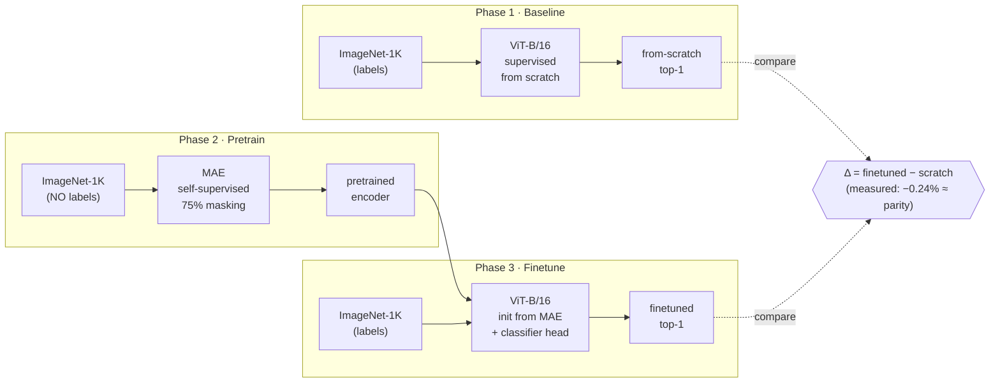
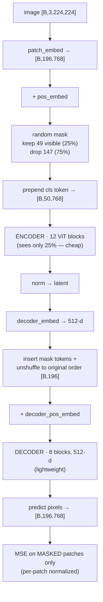
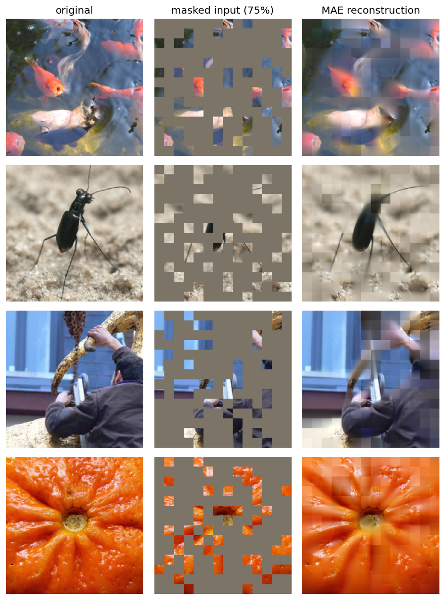
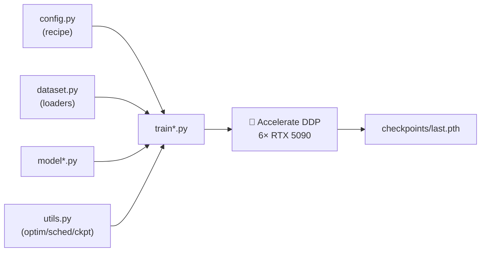
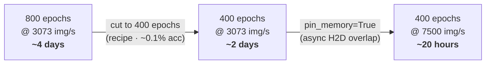

# MAE from Scratch on ImageNet-1K

Reproducing **Masked Autoencoders Are Scalable Vision Learners** (He et al., CVPR 2022) end-to-end as a learning project — a supervised baseline, self-supervised MAE pretraining, and finetuning, all built from scratch with PyTorch + 🤗 Accelerate on a 6× RTX 5090 box.

**The question this repo answers:** *how much does MAE self-supervised pretraining actually buy you over training the same ViT-B/16 from scratch?* The paper reports ≈ **+1.3%** top-1 over its supervised baseline. This project measures that delta on a **rigorously matched** comparison — and lands on a more nuanced answer (**MAE reaches *parity* with a strong baseline, −0.24% ≈ seed noise**; see [Results](#results) and [Findings](#findings)) — while documenting the multi-GPU engineering needed to train it fast on consumer GPUs with no P2P.

---

## The 3-phase design



Phase 1 gives the honest *from-scratch* number. Phase 2 learns representations with **no labels**. Phase 3 finetunes that encoder and measures the gap — the whole point of the project.

---

## How MAE works (Phase 2)

Mask **75%** of the patches and reconstruct the missing pixels. The design is **asymmetric**: the heavy encoder only ever sees the visible 25%, so pretraining is cheap.



The masking trick: draw random noise per patch, `argsort` it to get a shuffle, keep the first 49, and remember the inverse permutation (`ids_restore`) so the decoder can un-shuffle the visible tokens + mask tokens back into image order.

---

## Reconstructions

The whole idea, made visual. The encoder sees only the **25% of patches** in the middle column; the decoder fills in the rest (right). Blurry — it's pixel-MSE, not a GAN — but *semantically right*: the model inferred the goldfish, the beetle's legs and antennae, the person's arm, and the orange's radial texture from a quarter of the image.



*Left → original · Middle → the masked input the encoder actually receives (75% of patches dropped) · Right → MAE's reconstruction (visible patches kept, masked patches predicted by the decoder). Pretrained 400 epochs, mask ratio 0.75.*

> **SimMIM reconstructions coming** once its pretraining finishes — same three-panel view, for a side-by-side **MIM-drop (MAE) vs MIM-keep (SimMIM)** comparison.

---

## Repo structure

```
phase1/   supervised ViT-B/16 from scratch   → the baseline
phase2/   MAE self-supervised pretraining     (model_mae.py, train_mae.py)
phase3/   finetune the pretrained encoder
run_phase{1,2,3}.sh   Accelerate launch scripts (6-GPU DDP)
```

Each phase is self-contained: `config.py` (recipe as a class), `dataset.py` (Albumentations + loaders), `model*.py`, `train*.py`, `utils.py`.



---

## Training recipe (MAE pretrain)

| | |
|---|---|
| Backbone | ViT-B/16 encoder + 8-block / 512-d decoder |
| Masking | 75% random |
| Loss | per-patch-normalized pixel MSE, masked patches only |
| Optimizer | AdamW (β = 0.9, 0.95), weight decay 0.05 |
| LR | 1.5e-4 base, linear-scaled by batch, 40-epoch warmup + cosine |
| Batch | 192/GPU × 6 GPUs × 4 accum = **4608 effective** |
| Epochs | **400** (paper uses 800; ≈ 0.1% finetune cost for 2× less compute) |
| Precision | bf16 |

---

## Results

All numbers on the **held-out 50k `/val`** — an in-distribution holdout (peeled from train and *removed* from it), so absolutes run ~+2% above the official ILSVRC val: **track the delta, not the raw number.** Both models: same train set (1.23M), same val, same eval protocol + EMA — the *only* difference is the model's initialization.

| Model | Init | Top-1 (`/val`) |
|---|---|---|
| ViT-B/16 from scratch (Phase 1) | random | **84.51%** |
| ViT-B/16 finetuned (Phase 3) | MAE 400-ep pretrain | **84.27%** |
| **Δ (MAE − scratch)** | | **−0.24%** *(statistical parity)* |

MAE was reproduced **faithfully** (84.27 ≈ the paper's 400-epoch finetune) and finetunes to **parity** with a strong from-scratch baseline — the −0.24% gap sits inside run-to-run seed noise (±0.1–0.3%). It **matches**, but doesn't *beat*, a well-tuned supervised recipe here.

---

## Findings

**MAE reaches parity — and the *path* to that number is the real result.**

The headline delta **collapsed toward zero** as three confounds were caught and fixed — each a lesson in how easy it is to fool yourself with a sloppy comparison:

| Stage | train | val | aug | MAE | scratch | Δ |
|---|---|---|---|---|---|---|
| initial | 90% (k-fold) | k-fold holdout | weak | 83.44 | — | *invalid* |
| matched val | 90% | `/val` | weak | 83.65 | 84.51 | −0.86 |
| matched train | 100% | `/val` | weak | 84.06 | 84.51 | −0.45 |
| **matched aug** | **100%** | **`/val`** | **matched** | **84.27** | **84.51** | **−0.24** |

1. **Val-set mismatch** — Phase 3 originally validated on its own k-fold slice of *train*, while the baseline used `/val`. Apples vs oranges. Matching the val set → −0.86.
2. **Train-set mismatch** — Phase 3 trained on only 90% of train (the k-fold left 10% out) vs the baseline's 100%. Matching the train set → −0.45.
3. **Augmentation mismatch** — Phase 3 ran weaker aug (RandomResizedCrop + flip only) vs the baseline's timm **RandAugment + Random Erasing**. Matching the augmentation (identical timm pipeline) → **−0.24 — statistical parity.**

**Why it's a dead heat:** the supervised baseline (84.51 ≈ 82% official-equivalent) is *strong* — right at the number the MAE paper reports for its own from-scratch ViT-B, and at MAE ViT-B's own ceiling (~83.6% official even with **1600**-epoch pretraining). With a supervised recipe this good and everything matched, MAE lands **within seed noise** — it neither wins nor loses.

**The real lesson:** MAE's advantage over supervised training is **conditional on baseline strength.** Against a well-tuned supervised recipe on the same labeled ImageNet-1k it reaches *parity*, not a win; its genuine payoff comes from *extra unlabeled data* a supervised baseline can't use. Reproducing the paper's headline +1.3% would require comparing against the paper's *weaker* (~82.3%) baseline, not this elite one.

*(The de-confounding itself — chasing −1.07 → −0.86 → −0.45 → −0.24 by fixing val, train, and aug one variable at a time — is the methodological point of this repo.)*

---

## What MAE actually buys you

Parity on a strong baseline isn't the failure it looks like — it's the documented reality of MAE ViT-B on ImageNet-1k. The value is elsewhere, and the experiments show it:

- **The MIM signature (linear probe).** Freeze the MAE encoder, train *only* a linear head → **~59%** (vs **84.3%** finetuned) — a ~25-point gap. MAE features are **rich but not linearly separable**: excellent finetuning inits, poor linear readouts. Contrastive/DINO is the mirror image (high probe, lower finetune). This is the defining property of masked image modeling.
- **Convergence.** The MAE encoder finetunes to parity in **100 epochs**; the from-scratch baseline needs **~300**. The pretrained features are a strong starting point — but note MAE also spent 400 *label-free* pretraining epochs, so it's not "less total compute," it's "the pretraining is reusable and label-free."
- **The real payoff = reusability + label efficiency.** Pretrain **once** on unlabeled data, then adapt fast to many downstream tasks; and with **few labels** MAE wins outright. MAE's edge over supervised training grows with model scale (ViT-L/H) and shrinks to zero against a well-tuned ViT-B supervised recipe.

**One-line takeaway:** *on ImageNet-1k ViT-B, MAE matches a strong supervised baseline — its win is label-free pretraining you can reuse, and that shines when labels are scarce.*

---

## Hardware & the performance story

Trained on **6× RTX 5090** (a 7th GPU, an RTX 3090, is deliberately excluded). The interesting constraint: consumer 5090s have **no GPU-to-GPU P2P**, so every gradient all-reduce is *host-staged over PCIe at ~2.2 GB/s* across two NUMA sockets — a hard comm wall that caps multi-GPU scaling.

Getting MAE pretrain from a 4-day estimate down to ~20 hours came from two independent levers:



- **Fewer epochs** (800 → 400): a *modeling* call — MAE's finetune accuracy plateaus, so half the compute costs ≈ 0.1%.
- **`pin_memory=True` + `prefetch_factor=4`**: the *engineering* fix — the CPU→GPU batch copy now overlaps compute instead of stalling the GPU each step (6000 → 7500 img/s).
- What **didn't** help, despite testing: bigger batch (0%), `torch.compile` (+1.6% — the run is comm-bound, and MAE's `gather`/`scatter` masking ops don't fuse).

Every non-trivial problem — the 6-GPU crash, the comm wall, the compile saga, the pin_memory hunt — is written up in **[Issues](../../issues?q=is%3Aissue)**.

---

## Running it

```bash
# Phase 2 — MAE pretraining (6-GPU DDP)
bash run_phase2.sh
```

Requirements: `torch`, `timm`, `accelerate`, `albumentations`, `transformers`, and **`nvidia-nccl-cu12==2.26.5`** (the bundled NCCL 2.26.2 crashes on the 5090). Always launch via the `run_phase*.sh` scripts — they pass `--gpu_ids 0,1,2,3,5,6` (excluding the 3090, which otherwise triggers an illegal-memory crash) and set up the NCCL/comm environment.

---

## Reference

He, Chen, Xie, Li, Dollár, Girshick. *Masked Autoencoders Are Scalable Vision Learners.* CVPR 2022. [arXiv:2111.06377](https://arxiv.org/abs/2111.06377)
